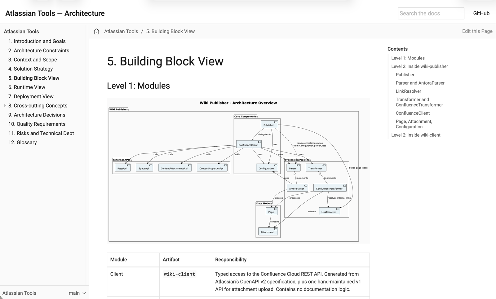
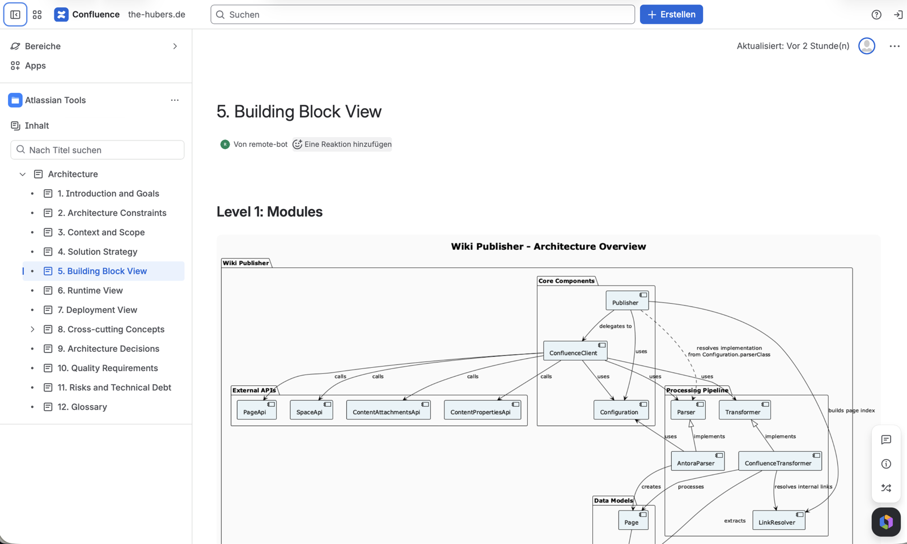

# Atlassian Tools

A comprehensive suite of Java tools and libraries designed to streamline integration with Atlassian Confluence. This project provides a robust REST API client, a powerful HTML publishing utility, and a Maven plugin to automate your documentation workflow.

## Same source, both targets

This project's own architecture documentation is written once in AsciiDoc and published to two
places by the tools in this repository. Chapter 5 in both, side by side:

| Antora site | Confluence |
| :---: | :---: |
| [](https://huber-and.github.io/atlassian-tools) | [](https://the-hubers.atlassian.net/wiki/spaces/AT/pages/65437698/Architecture) |
| **[Open the site →](https://huber-and.github.io/atlassian-tools)** | **[Open it in Confluence →](https://the-hubers.atlassian.net/wiki/spaces/AT/pages/65437698/Architecture)** |

Navigation becomes a page tree, the diagram becomes an attachment, internal links keep working —
and pages whose content has not changed are left untouched, so the page history stays readable.

## Project Modules

This multi-module Maven project consists of the following components:

### 1. `wiki-client`
**Confluence REST API Client**
A strongly-typed, auto-generated Java client for the Confluence Cloud REST API (v2).
- **Package**: `net.atlassian.wiki.rest`
- **Features**:
  - Full coverage of Confluence V2 API.
  - Specialized support for attachment management (V1 API).
  - Built with **Java 21** and **Jakarta EE**.
  - Powered by **Apache HttpClient 5**.

### 2. `wiki-publisher`
**HTML to Confluence Publisher**
A utility library that parses local documentation (HTML/Antora) and publishes it to Confluence.
- **Features**:
  - Parses HTML structures (optimized for Antora).
  - Transforms content into Confluence Storage Format.
  - Preserves page hierarchy and structure.
  - Handles attachments and images.

### 3. `atlassian-maven-plugin`
**Maven Integration**
A Maven plugin that brings the power of the `wiki-publisher` directly into your build lifecycle.
- **Goal**: `atlassian:publish`
- **Features**:
  - Automate documentation publishing as part of `mvn site` or `mvn deploy`.
  - Flexible configuration for mapping local directories to Confluence spaces.
  - Secure credential management via Maven `settings.xml`.

### 4. `architecture-docs`
**Architecture Documentation** — 📖 [read the site](https://huber-and.github.io/atlassian-tools) · 🔗 [see it published in Confluence](https://the-hubers.atlassian.net/wiki/spaces/AT/pages/65437698/Architecture)
The architecture documentation of this project, written in AsciiDoc following the
[arc42](https://arc42.org/) template, built into an Antora site and published to Confluence by
`atlassian-maven-plugin` itself — so it doubles as the end-to-end example of how to use the plugin.
- Build the site: `mvn -pl architecture-docs clean compile`
- Publish to Confluence: `mvn -pl architecture-docs clean compile atlassian:publish`
- Published to GitHub Pages by `.github/workflows/pages.yml` and to Confluence by `.github/workflows/confluence.yml`, both on push

## Requirements

- **Java**: JDK 21 or later
- **Maven**: 3.9 or later

## Installation & Usage

All artifacts are available via Maven.

### Using the Client Library

Add the dependency to your project:

```xml
<dependency>
    <groupId>io.github.huber-and.atlassian</groupId>
    <artifactId>wiki-client</artifactId>
    <version>${atlassian-tools.version}</version>
</dependency>
```

### Using the Publisher Library

```xml
<dependency>
    <groupId>io.github.huber-and.atlassian</groupId>
    <artifactId>wiki-publisher</artifactId>
    <version>${atlassian-tools.version}</version>
</dependency>
```

### Using the Maven Plugin

Configure the plugin in your `pom.xml`:

```xml
<build>
    <plugins>
        <plugin>
            <groupId>io.github.huber-and.atlassian</groupId>
            <artifactId>atlassian-maven-plugin</artifactId>
            <version>${atlassian-tools.version}</version>
            <configuration>
                <url>https://your-domain.atlassian.net/wiki</url>
                <mappers>
                    <mapper>
                        <spaceKey>DOCS</spaceKey>
                        <root>Architecture</root>
                        <path>src/docs/site</path>
                    </mapper>
                </mappers>
            </configuration>
        </plugin>
    </plugins>
</build>
```

#### Mapper options

| Element | Default | Description |
|---|---|---|
| `spaceKey` | — | The Confluence space key to publish into. Required. |
| `path` | — | Local directory containing the generated site. Required. |
| `root` | — | Title of the page all content is created under. Without it, pages are created at space level. |
| `deleteOrphans` | `true` | Move pages below `root` that no longer exist locally to the Confluence trash. |

`deleteOrphans` is what keeps the space in sync when a page is deleted or renamed — without it, the previous page
stays behind. It only takes effect when `root` is set, because otherwise the scope would be the entire space.
Setting it to `false` does not disable the check: orphans are still reported in the build log as
`Would move to trash: …`, so you can preview exactly what enabling it would remove.

Pages are deleted into the trash, never purged, so anything removed by mistake can be restored in Confluence.

#### Skipping the publish

```bash
mvn atlassian:publish -Datlassian.skip=true
```

## Building from Source

To build the entire project locally:

```bash
mvn clean install
```

To build a specific module:

```bash
mvn -pl wiki-client clean install
```

## License

This project is licensed under the Apache License 2.0 - see the [LICENSE](LICENSE) file for details.
